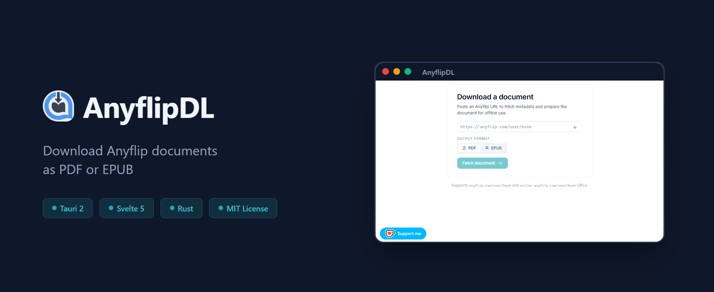
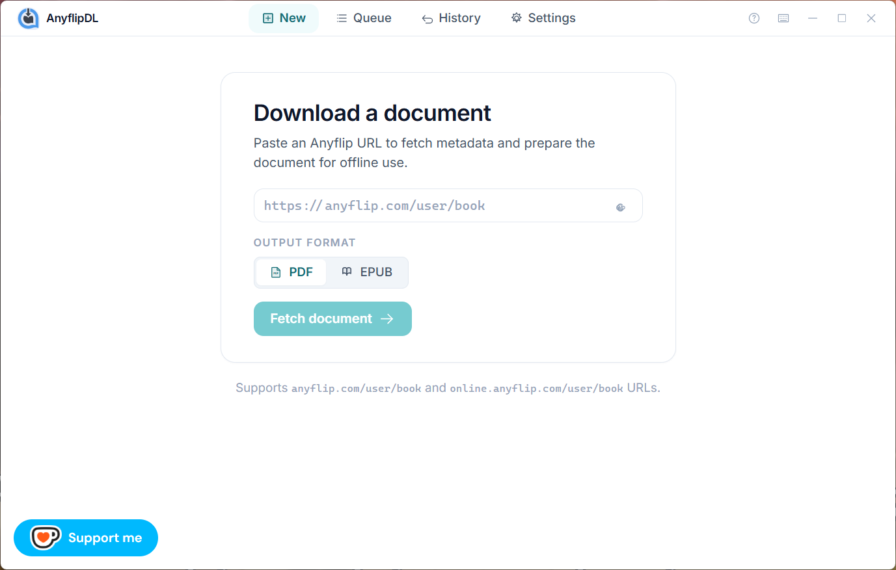

# AnyflipDL



<p align="center">
  <a href="https://ko-fi.com/divine_owl">
    
  </a>
</p>

[](https://tauri.app)
[](https://svelte.dev)
[](https://rust-lang.org)
[](./LICENSE)

**Download Anyflip documents as PDF or EPUB for offline reading.**



## About

AnyflipDL is a native Windows desktop app that downloads documents hosted on [Anyflip.com](https://anyflip.com) — magazines, catalogs, brochures, presentations — and saves them as PDF or EPUB files. Paste a URL, pick a format, get a file. Zero friction.

## Features

- **PDF & EPUB export** — Choose the format that works for you
- **Concurrent downloads** — Fetches up to 4 pages simultaneously
- **Pause & resume** — Interrupt and continue without losing progress
- **Download queue** — Queue multiple documents, processed one at a time
- **Password support** — Handles password-protected documents
- **Resume on failure** — Incomplete downloads resume from where they left off
- **Custom file naming** — Template-based output file names
- **Light & dark theme** — Match your system preference
- **Auto-update check** — Notified when new versions are available

## Tech Stack

| Layer | Technology |
|-------|------------|
| Frontend | [Svelte 5](https://svelte.dev) + [Tailwind CSS v4](https://tailwindcss.com) + [SvelteKit](https://kit.svelte.dev) |
| Backend | [Rust](https://rust-lang.org) (edition 2021) |
| Desktop | [Tauri 2](https://tauri.app) |
| PDF | [printpdf](https://crates.io/crates/printpdf) |
| EPUB | [epub-builder](https://crates.io/crates/epub-builder) |

## Getting Started

### Prerequisites

- [Node.js](https://nodejs.org) (v18+)
- [Rust](https://rustup.rs) (stable toolchain)
- [Tauri CLI](https://tauri.app) (`cargo install tauri-cli`)

### Install

```bash
git clone https://github.com/Divine-Owl/anyflipDL.git
cd anyflipDL
npm install
```

### Development

```bash
npm run tauri dev
```

### Build

```bash
npm run tauri build
```

The installer will be in `src-tauri/target/release/bundle/`.

## Usage

1. Paste an Anyflip URL (`anyflip.com/user/book` or `online.anyflip.com/user/book`)
2. Select output format: **PDF** or **EPUB**
3. Click **Fetch document**
4. Wait for the download to complete
5. Find your file in the configured save location (default: `Downloads`)

## Project Structure

```
anyflipDL/
├── src/                    # Frontend (Svelte 5 + TypeScript)
│   ├── lib/
│   │   ├── components/     # Reusable UI components
│   │   ├── screens/        # App views (URL input, queue, history, settings)
│   │   ├── stores/         # Svelte reactive state
│   │   └── ipc/            # Tauri IPC layer
│   └── routes/             # SvelteKit routes
├── src-tauri/              # Backend (Rust)
│   └── src/
│       ├── commands/       # Tauri command handlers
│       ├── services/       # Core logic (download, PDF/EPUB generation)
│       ├── models/         # Data models
│       └── data/           # Config & persistence
└── static/                 # Static assets
```

## License

[MIT](./LICENSE) © [Divine-Owl](https://github.com/Divine-Owl)
